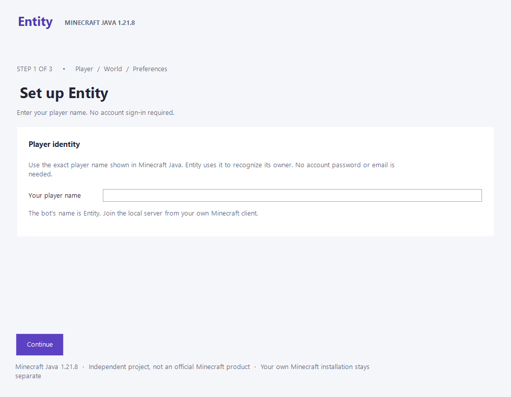
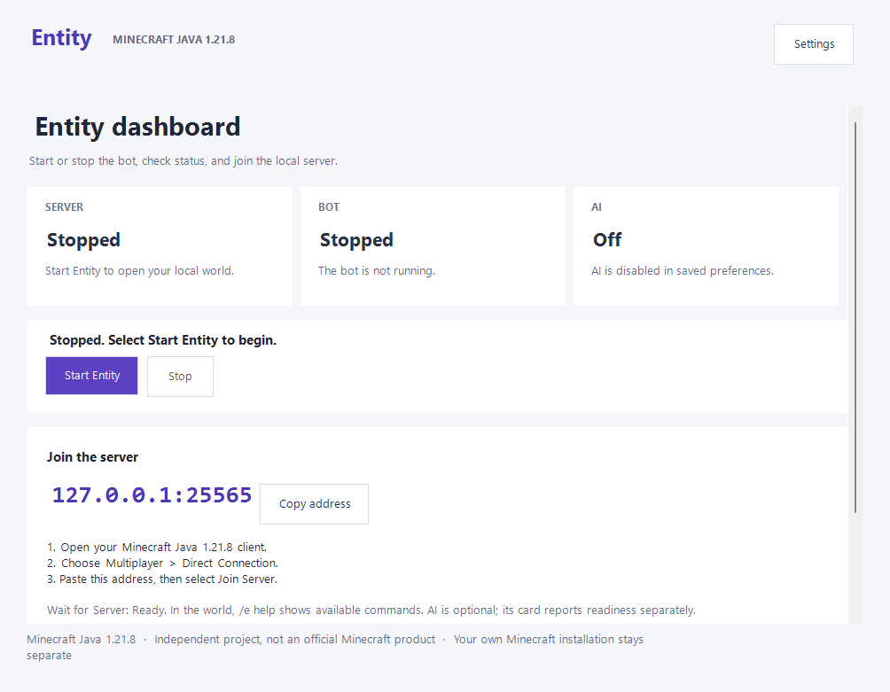

# Entity

A Minecraft survival bot for gathering resources, managing a base and building
schematics. Control it with in-game commands or optional AI chat.

**[Download Windows installer · 2.22.2](https://github.com/MrCreeper8/Entity/releases/download/v2.22.2/Entity-Setup-2.22.2-win-x64.exe)**  
Windows x64 · Minecraft Java 1.21.8 · No Prism required

You only need the installer above. **The JAR, JSON and source-code files are not
extra installation steps.** Entity prepares a separate bot installation; your
own Minecraft client does not need mods.

## Start playing in three steps

1. **Install.** Open `Entity-Setup-2.22.2-win-x64.exe` and click **Install Entity**.
   Entity opens when installation finishes.
2. **Set up.** Enter your Minecraft name, choose a new local server or your
   compatible existing server, and choose whether to enable AI. Follow the short
   guide; leave Advanced settings alone unless needed.
3. **Start and join.** Start Entity from the dashboard. In your own Minecraft
   Java **1.21.8**, open **Multiplayer → Direct Connection** and paste the
   address from **Copy address**.

**[Step-by-step installation help](docs/getting-started.md)** ·
[Release notes and other downloads](https://github.com/MrCreeper8/Entity/releases/tag/v2.22.2)

## What you need

- A Windows x64 computer that can run Minecraft Java 1.21.8, and your normal
  Minecraft installation for playing.
- Internet for first setup. Entity downloads its own Java, Minecraft bot
  dependencies and local Paper server.
- Optional AI: Managed Local needs a compatible NVIDIA/CUDA GPU and roughly
  3 GB of downloads. **AI Off** needs no model and keeps normal commands.
  External local/cloud providers are available under AI settings.

Visible and Background run the same complete bot client. Background hides and
silences its window; it is not GPU-free server execution. Both modes isolate the
bot's mouse and keyboard. Your own Minecraft graphics settings stay unchanged.

This release uses an offline bot name on a **local, deliberately offline Paper
server**. Account login, Realms, vanilla servers and remote-hosted bridges are not
supported. Do not weaken an existing public server's authentication.

## Once you are in the world

Use `/e help` for available commands. `/e come`, `/e follow` and `/e stop` are
useful first commands. With AI enabled, address Entity in chat using
`e come here` or `ent what do you have?`.

[AI choices and privacy](docs/ai-and-privacy.md) ·
[Building with schematics](docs/schematics.md)

## Important limits

Gameplay and conversation remain experimental. This usability release is not a
new all-biome or all-schematic survival survey; earlier acceptance gaps remain
documented in the release notes. AI replies are not guarantees of completed work.
Back up an existing world before attaching a server. Keep worlds and data when
updating; never replace them with application files.

The installer is unsigned, so Windows may show an unknown-publisher warning.
Download only from this repository's release. Do not disable Windows security
or antivirus protection to install it.

Advanced downloads, source builds and licenses

The release also contains a portable ZIP, client/server JARs, SHA-256 checksums
and compact acceptance evidence. Most players do not need these separately.
Matching client/server build identities are required for manual setup.

[Build and pair from source](docs/building-source.md) ·
[Original-code license](LICENSE) · [Third-party notices](THIRD-PARTY-NOTICES.md) ·
[Binary notices](BINARY-NOTICES.md)

Original Entity code is all rights reserved with the personal-use permission in
LICENSE; it is not open source. Third-party rights are preserved. This is an
independent project, not an official Minecraft product.

